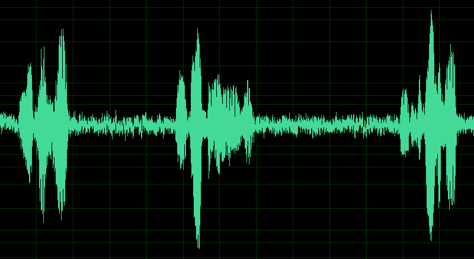
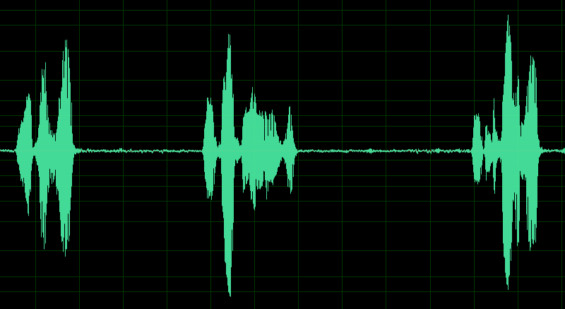

## 语音活动检测(Voice Activity Detection)库使用说明

### 概述

VAD项目基于WebRtc的common_audio提取出来的VAD模块和NS进行封装，可以方便的进行实时的音频流检测以及噪音抑制。
参考链接 (https://opensource.google.com/projects/webrtc)

### 编译

本项目基于CMake进行构建，经测试可以在linux以及windows下编译运行。

测试环境:
*visual studio 2013 on windows 10*
*gcc 5.4 on ubuntu 16.04*
在 linux 上使用如下方式进行编译安装:
```bash
mkdir build
cd build
cmake ..
make install #头文件,库文件以及可执行程序将安装至项目的output目录下 
```

### 小工具
我们使用m2_vad库做了两个小程序供参考。
#### m2splitter
可以进行音频文件的自动断句切割成独立的音频文件。使用方式如下：
```bash
cd output/bin
export LD_LIBRARY_PATH=$PWD/../lib
#仅支持16bit、单声道、8000或16000采样率的wav文件
#使用-l 参数指定vad灵敏度,取值范围(0-5)，默认为2, 环境越嘈杂这个值就需要越大
#使用-i 参数指定输入音频文件
#使用-o 参数指定输出文件存放的目录（如果不存在将自动创建）
./m2splitter -l 2 -i test_16k.wav -o outputDirectory
```
#### m2NoiseReducer
可以进行音频文件的降噪处理。使用方式如下：
```bash
cd output/bin
export LD_LIBRARY_PATH=$PWD/../lib
#仅支持16bit、单声道、8000或16000采样率的wav文件
#使用-i 参数指定输入音频文件
#使用-o 参数指定输出音频文件
./m2NoiseReducer -i test_noise_16k.wav -o denoise.wav
```

通过对比波形图可以看到降噪明显的效果：

降噪前：



降噪后：



### API使用说明

m2_vad.h 和 m2_ns.h 中有详细的函数说明，在此不再赘述。整体的使用流程伪代码如下：

```c
//创建VAD实例
M2VAD * vad_handle = M2VAD_create();
//初始化设置起点检测时间为300ms 尾点的检测时间为900ms， 采样率为16000
M2VAD_init(vad_handle, 16000, 300, 900);
//设置VAD灵敏度(如果不设置，取值范围0-5默认灵敏度为2)
//越嘈杂的环境灵敏度就需要设置的越高
M2VAD_set_sensitivity(vad_handle, 2);
//如果环境嘈杂还是建议先进行降噪在进行vad检测，这样的效果会更好，下面一段创建一个降噪实例
M2NS * ns_handle = M2NS_create();
//初始化设置采样率
M2NS_init(ns_handle, 16000);
unsigned char frame_buf[640 * 2];
//实时进行音频流降噪和检测
while(1)
{
    //在以流式进行降噪和vad检测时建议每次传入的数据量为320字节的整数倍,这样效率最高
    //这里假设每次从音频流中获取一段640Byte的数据(frameData) 进行降噪和vad检测
    int len = M2NS_process(ns_handle, frameData, 640, frame_buf, 640*2);
    if(len > 0)
    {
         M2VADDetectResult result = M2VAD_process(vad_handle,
                                                frame_buf,
                                                 len);
        if(result == M2_VAD_ERROR_IN_PROCESS)
        {
            printf("ERROR: M2VAD_init failed\n");
            exit(1);
        }
        else if(result == M2_VAD_START_POINT_DETECTED)
        {
            printf("TRACE: start point detected\n");
        }
        else if(result == M2_VAD_END_POINT_DETECTED)
        {
            printf("TRACE: end point detected\n");
        }   
    }
}
```

### Q&A
